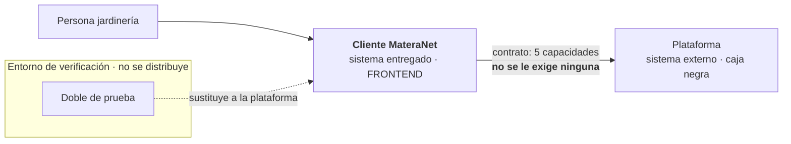
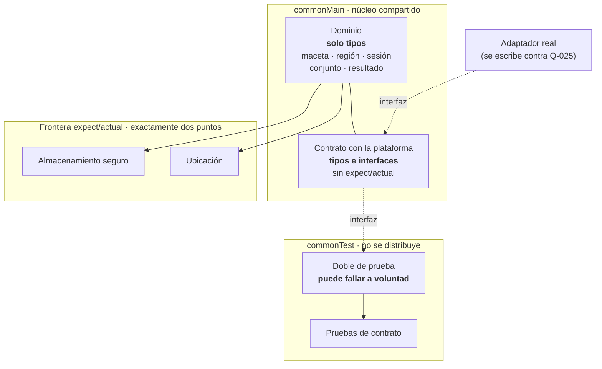

# Diseño — `andamiaje-kmp`

## Contexto

El proyecto no tiene software. La plataforma —API, gestión, macetas— es externa y se trata
como caja negra (`SyRS.md` SYR-R01). Este change construye la primera pieza: el proyecto
Kotlin Multiplatform con su frontera hacia esa caja negra, y un entorno que permita
verificarla sin depender de la plataforma.

**ADRs en vigor** (ninguna supersedida): `0001` KMP como stack y `commonMain` con frontera
de dos puntos · `0002` identidad delegada a sesión de plataforma, estatus `proposed` por
`SA-04` sin confirmar · `0003` región por ubicación del dispositivo · `0004` configuración
remota con valor por defecto horneado · `0005` fallo y vacío como estados distintos en el
tipo. Este diseño es coherente con las cuatro aceptadas.

**Restricciones del entorno**, medidas y no supuestas: JDK 21 presente; Gradle por wrapper;
**SDK de Android ausente** —solo `platform-tools`—; **sin toolchain de Apple**, y en Linux
el objetivo de iOS no se compilará nunca. Red disponible.

**Dos precisiones que el diseño respeta y conviene no perder de vista:**

- `adr/0001` menciona ubicación, almacenamiento seguro y **red** como «la capa de
  plataforma», pero su frase operativa fija la frontera en **dos** puntos: almacenamiento
  seguro y ubicación. La red queda fuera de la frontera porque la biblioteca de
  comunicación es en sí misma multiplataforma. Esta lectura es la que permite declarar el
  contrato sin gastar ninguno de los dos puntos.
- `adr/0001` observa que *un segundo objetivo solo justifica KMP cuando existe un segundo
  consumidor*. El objetivo de JVM que se propone aquí **no es un consumidor**: es un
  instrumento de verificación. Confundirlo con uno sería exactamente el error que la propia
  ADR señala.

## Objetivos / No objetivos

**Objetivos:**

- Declarar el contrato mínimo del cliente, en el vocabulario del cliente, sin exigir nada a
  la plataforma.
- Dejar el dominio compilable y verificable sin emulador ni dispositivo, que es el criterio
  de confirmación de `adr/0001`.
- Proporcionar un doble de prueba que permita **fallar a voluntad**, que es el instrumento
  que la confirmación de `adr/0005` exige y que contra la plataforma real sería inalcanzable.
- Impedir por construcción que una compilación de distribución lleve el doble de prueba.

**No objetivos:**

- Implementar cualquiera de las 33 SYR. `commonMain` lleva vocabulario, no comportamiento.
- Conocer la forma del API de la plataforma. `Q-025` sigue abierta y este change no la
  cierra.
- Resolver `SA-04`. El riesgo queda confinado al adaptador real.
- Verificar iOS. Es imposible en Linux; se registra como limitación, no como tarea.
- Escribir la primera rebanada. Se propone aparte como `rebanada-1-listado-regional`.

## Decisiones

### D-01 — El contrato es del cliente, con cinco capacidades

**Resuelve `DD-01` como declaración propia**, no como descripción del API. Se recupera la
tabla de D-02 (E-027) y se le retira una capacidad: *determinar la región de la cuenta*,
que `adr/0003` volvió innecesaria al resolver la región por el dispositivo. **Pedirla sería
pedir menos de lo necesario**, y el principio de E-028 manda en el mismo sentido: quitar
exigencias, no añadirlas.

**Considerada y descartada — el contrato como lista de deseos a la plataforma.** Definir el
como lo que *debería* exponer la plataforma. Es la forma que produjo E-027 y la que E-028
corrigió: convierte incertidumbre en dependencia. Descartada.

**Supuestos declarados:** la plataforma expone hoy al menos el conjunto de una región; la
caja negra no cambia de forma sin aviso. **Abierto:** `Q-025`.

### D-02 — La frontera se mantiene en dos puntos y el contrato no la consume

El contrato se expresa con tipos e interfaces de `commonMain` que **no requieren
`expect`/`actual`**, porque la biblioteca de comunicación es multiplataforma. Así se
declara la costura sin gastar ninguno de los dos puntos de `adr/0001`, y sin un tercer
punto.

**Considerada y descartada — el contrato como `expect`/`actual`.** Habría sido la lectura
natural, y habría creado un tercer punto de frontera, contradiciendo la ADR. Descartada
por contradicción directa con un compromiso en vigor.

### D-03 — Un objetivo de JVM, como instrumento de verificación y no de distribución

Se declara un objetivo `jvm()` cuyo único propósito es hacer ejecutable la confirmación de
`adr/0001` en una máquina que no tiene SDK de Android. Android e iOS se declaran también:
Android compila tras instalar su SDK; **iOS queda declarado y no compilable aquí**.

El objetivo de JVM **no se distribuye y no se publica**. No es el «segundo consumidor» que
`adr/0001` dice que justificaría KMP, y no debe leerse como uno: es una herramienta de
medición, como lo sería un perfilador.

**Consideradas y descartadas:**

- *Solo Android e iOS.* La puerta del change sería una promesa: nada se compila ni se
  prueba en esta máquina, que es el defecto que este change viene a corregir.
- *Instalar el SDK de Android y nada más.* Compila Android, pero deja el objetivo de JVM
  como la única vía de probar el dominio en cualquier entorno, incluida una máquina macOS
  sin Android.
- *Emulador de Android.* Aporta comprobación de integración que este change no necesita, a
  cambio de gigas y de un emulador sin cabeza que nadie va a mirar.

### D-04 — El doble de prueba no puede viajar en una distribución, y no por banderas

La separación es **por composición**: hay dos puntos de composición, el de depuración pasa
el doble y el de distribución pasa el adaptador real. No hay ninguna condición sobre el tipo
de compilación en ninguna parte.

**Considerada y descartada — bandera de tipo de compilación.** `if (debug) doble else real`
es más corto y familiar, y es exactamente el tipo de condición que un día queda activada por
error en un canal de publicación. Se descarta porque la propiedad que se quiere proteger —que
un artefacto distribuible no simule datos— merece una garantía de compilación, no una
disciplina de revisión.

El beneficio que no era visible al elegir esto: **un fallo del doble es indistinguible de un
fallo de la plataforma real**, porque es el mismo tipo. Por eso el doble sirve para
verificar el contrato y no solo para demostrar la interfaz.

### D-05 — `commonMain` lleva vocabulario, no comportamiento

`commonMain` lleva los tipos que el contrato necesita para hablarse —maceta, región, sesión,
conjunto, resultado de tres estados— y ningún comportamiento propio. Las 33 SYR siguen
perteneciendo a las rebanadas.

**Considerada y descartada — incluir el comportamiento que el contrato exige verificar.**
Verificaría antes, pero convertiría `andamiaje-kmp` en la primera rebanada con otro nombre, y
un change de andamiaje que implementa requisitos de negocio es difícil de archivar. Es el
mismo defecto que se corrigió en `tasks.md` de `implementar-sistema-desde-sysr`.

## Riesgos / Compromisos

- **[El contrato puede no encajar con la plataforma real]** → El doble valida consistencia
  interna, no capacidad de la plataforma. La comprobación real es la tarea 1.x del SRS y
  sigue abierta. El contrato está escrito para el peor caso precisamente para que el ajuste
  sea del adaptador.
- **[`SA-04` resulta falsa y no hay sesión de plataforma]** → Con `adr/0002` en estatus
  `proposed`, el riesgo está confinado al adaptador real. Si resulta falsa, se emite un ADR
  que lo superseda y el cambio alcanza a un archivo, no al dominio.
- **[iOS no se compila nunca en este entorno]** → Riesgo aceptado y escrito. La
  consecuencia real es que **el primer error de compilación en iOS aparecerá en la primera
  rebanada**, no aquí. Se mitiga declarando el objetivo ahora, para que la configuración
  exista aunque no se compile.
- **[El objetivo de JVM se convierte con el tiempo en un tercer objetivo de distribución]**
  → Se registra en el ADR que no se distribuye. Si alguna vez se publica, es una decisión
  nueva, no una evolución natural.
- **[Gradle multiplica objetivos y compilaciones hasta que la configuración llega a
  partirse]** → Riesgo señalado por
  `adr/0001` como el mayor coste conocido de la decisión. Este change no lo aumenta, pero no
  lo reduce: paga esa deuda para poder medir.
- **[La suite del dominio pasa mientras el doble miente]** → Mitigación: el doble no es una
  implementación alternativa que se pueda degradar por descuido; es código de prueba, y su
  ruta de distribución no existe.

## Plan de migración

No hay migración: no existe sistema anterior. El orden es de construcción y las puertas
son acumulativas.

1. Instalar el SDK de Android, porque sin él el objetivo de Android no configura y la
   configuración de KMP es todo-o-nada.
2. Esqueleto Gradle con los tres objetivos declarados y `commonMain` con los tipos.
3. Contrato y doble de prueba; pruebas de contrato, incluida la del fallo a voluntad.
4. **Puerta:** `commonMain` compila y la suite pasa sin emulador ni dispositivo, y no hay
   `expect`/`actual` fuera de los dos puntos.
5. Recién entonces `rebanada-1-listado-regional`, que da uso al vocabulario.

**Reversión:** el proyecto no está publicado y no tiene consumidores. Borrarlo es la
reversión completa, y no afecta ningún sistema externo.

## Preguntas abiertas

- **`Q-025`** — la forma real del API de la plataforma. Bloquea el adaptador real, no este
  change.
- **`Q-030` / `SA-04`** — si la plataforma expone autenticación. Bloquea `adr/0002`, no la
  construcción.
- **`adr/0001`, cómoda pero no revisitada** — el objetivo de JVM se añade a un conjunto que
  la propia ADR ya advierte que tener objetivos que no se justifican entre sí es un
  problema.
  La justificación aquí es distinta y explícita —verificación, no reutilización— pero si en
  el futuro `jvm()` llegara a distribuirse, esa objeción aplicaría de lleno y correspondería
  un ADR que lo superseda. Se deja anotado para el paso de ADR; **no se modifica `adr/0001`**.
- **Volumen de la verificación de `SYR-27`** — sigue diferido por `DD-08` y no lo abre este
  change.
