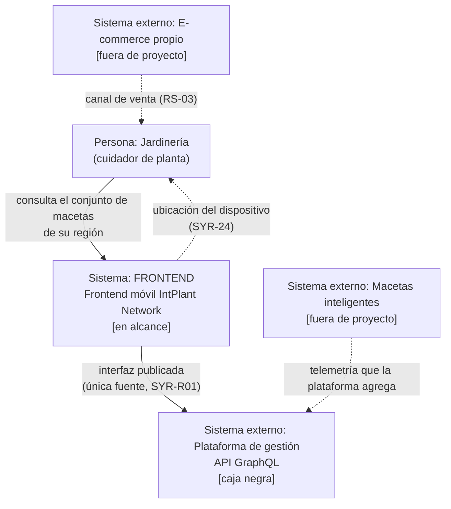
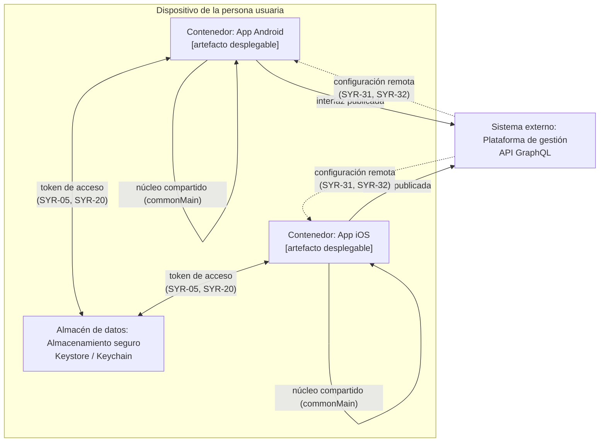
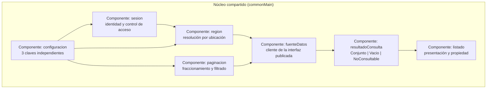
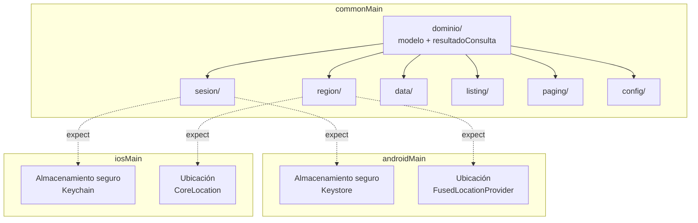

# Diseño — `implementar-sistema-desde-sysr`

## Contexto

`FRONTEND` es el único sistema de este proyecto. Backend, plataforma de gestión y hardware
de macetas son **caja negra** tras la API (SYR-R01, SYR-15; E-016). El sistema se está
construyendo desde cero: no hay fuente, ni `package.json`, ni historial git.

El diseño traduce el nivel de sistema (33 SYR) al nivel de software. No inventa
capacidades: donde `SyRS.md` difirió una decisión (DD-01…DD-08), este diseño o la cierra
explícitamente o la mantiene diferida y lo dice.

**Estado de los ADRs:** no existe `<repo>/adr/`. Ningún ADR vigente restringe este diseño,
y ninguna decisión previa debe considerarse compromiso vivo.

## Objetivos / No-objetivos

**Objetivos:**

- Respetar la frontera de caja negra: el sistema consume la interfaz publicada y no conoce
  el interior de la plataforma (SYR-14, SYR-15).
- Inviolable: el estado de planta se recibe, nunca se calcula (SYR-R02).
- Imposible de confundir fallo con vacío (SYR-21): la distinción se representa en el tipo,
  no en la vista.
- Permitir endurecer la regla de acceso sin release (SYR-31, R-008).
- Dejar el diseño independiente del volumen de macetas (SYR-27, E-026).

**No-objetivos:**

- No se fija el esquema de la API: queries, campos, tipos y paginación siguen diferidos
  (**DD-01**).
- No se fija la forma de presentación —pantalla, mapa o ambos— (**DD-03**).
- No se implementa control de actuadores; el riesgo **R-004** permanece abierto.
- No se reconstruye `BITÁCORA.md`.
- No se define el volumen de verificación de SYR-27 ni la versión mínima de plataforma;
  ambas se **declaran** al implementar (**DD-08**).

## Decisiones

### DD-02 — Kotlin Multiplatform

Elegido: **Kotlin Multiplatform**, con la lógica de dominio en `commonMain` y adaptadores
de plataforma en `expect`/`actual` para Android e iOS.

| Alternativa | Por qué no |
|---|---|
| Expo / React Native | Descartada por decisión del usuario. Aportaba reutilización con el e-commerce (RS-03) y notifications push más simples. |
| PWA | Descartada por decisión del usuario. Habría sido la ruta más rápida a la primera rebanada y la de menor coste de despliegue. |
| Dejar DD-02 abierta | Habría dejado el diseño sin runtime, y SYR-32 exige decisiones ajustables de forma independiente, difícil de garantizar sin saber dónde vive la configuración. |

**Alternativa interna de KMP:** `commonMain` completo frente a compartir solo el dominio.
Se elige compartir **dominio y configuración**, y duplicar la capa de plataforma (ubicación,
almacenamiento seguro, red), porque la duplicación de esos adaptadores es barata y la del
dominio no lo es.

### DD-05 — Sesión emitida por la plataforma

Elegido: la plataforma emite un **token de acceso de vida corta**; el sistema lo guarda en
almacenamiento seguro del dispositivo (Android Keystore / iOS Keychain) y lo renueva por el
mecanismo que la plataforma defina.

El cliente **nunca** posee credenciales de la plataforma (SYR-18, SYR-20). La identidad no se
origina en el cliente: un identificador de dispositivo no produciría un «usuario del
sistema» del que SYR-12 pueda hablar, ni un «propio» del que SYR-13 dependa.

> **SA-04 no está respaldado por ningún documento.** `BRS.md` §8.2 `SA-01` define la
> capacidad de plataforma como telemetría y actuadores. La autenticación no figura. Esta
> decisión construye sobre una capacidad que nadie ha declarado.

### DD-06 — Región por ubicación del dispositivo

Elegido: **GPS**. Consecuencia: **SYR-24 permanece en alcance** y el total se mantiene en 33.

Se aceptó la fricción: diálogo de permiso, precisión del GPS como dependencia de arranque
bajo **RN-03**, y un segundo vector de datos personales que se suma a **R-008**.

**Consecuencia de diseño no evidente:** la resolución por ubicación **crea un tercer
resultado posible** además de «conjunto» y «vacío» — *región no resuelta*. Sin
representarla explícitamente, se colapsa en «no hay macetas», que es exactamente el
defecto que SYR-21 prohíbe. Por eso `resultadoConsulta` modela tres estados, no dos.

### DD-07 — Configuración remota con valor por defecto horneado

Elegido: documento de configuración **recuperado en ejecución** desde la plataforma, con
**tres claves independientes** y un valor por defecto seguro **horneado en el build** como
respaldo.

El respaldo **falla en cerrado**: sin red se aplica el valor más restrictivo, nunca el más
permisivo.

Un valor horneado **no** satisface SYR-31 por sí solo — cambiarlo exigiría publicar una
versión, que es un release de código en todo salvo en el nombre. La configuración remota es
lo que mantiene a R-008 genuinamente mitigado.

### Modelo de resultado de consulta — decisión transversal

El defecto de mayor consecuencia del sistema (SYR-21) no se resuelve en la vista, sino en el
**tipo**: `resultadoConsulta` distingue `Conjunto`, `Vacio` y `NoConsultable`, y la
presentación no puede colapsarlos porque el compilador lo impide.

## Diagramas C4

> **Alcance de los niveles.** Los cuatro niveles se incluyen por decisión explícita. Los
> niveles **Component** y **Code** son **bocetos provisionales**: dibujan fronteras que
> **DD-01** y **DD-03** han diferido expresamente, de modo que cambiarán al implementarse y
> su coste de mantenimiento puede superar su valor. Los niveles **Context** y **Container**
> son estables y derivan directamente de la caja negra.

### Nivel 1 — Contexto del sistema

**Límites.** FRONTEND es el único sistema del proyecto. No hay asignación de
responsabilidades entre sistemas porque no hay varios que repartir. El e-commerce y las
macetas no son responsabilidad de este frontend.

**Supuestos del diagrama.** Se asume que la plataforma expone una capacidad de
autenticación (**SA-04**, no respaldada) y que la configuración remota se sirve por la misma
interfaz publicada.

### Nivel 2 — Contenedores

**Responsabilidad de los contenedores.** Las dos apps son artefactos desplegables
independientes que comparten el mismo núcleo. El almacenamiento seguro es el único
depósito de credenciales: ninguno de los dos contenedores guarda secretos en claro
(SYR-18, SYR-20).

**Degradación.** Sin conectividad, cada app opera con el valor por defecto seguro de la
configuración y con `NoConsultable` como resultado de consulta, nunca con `Vacio`.

### Nivel 3 — Componentes del núcleo compartido

> **Boceto provisional.** El módulo `fuenteDatos` encapsula un cliente de la interfaz
> publicada cuya forma (queries, campos, paginación) está diferida por **DD-01**. Este nivel
> se redescribirá cuando DD-01 se cierre.

**Correspondencia 1:1 con las capacidades.** Siete componentes, siete especificaciones. El
mapa componente→spec es directo: `sesion`→`identidad-y-control-de-acceso`,
`region`→`resolucion-de-region`, `fuenteDatos`→`obtencion-de-datos`,
`listado`→`presentacion-del-listado`, `paginacion`→`escalabilidad-y-filtrado`,
`resultadoConsulta`→`fiabilidad-y-frescura`, `config`→`configurabilidad-y-mantenibilidad`.

**Regla de dependencia.** `resultadoConsulta` no depende de la vista: es la dirección que
impide que un fallo se presente como conjunto vacío (SYR-21). `config` no conoce a los
componentes que ajusta, solo expone las tres claves (SYR-32).

### Nivel 4 — Código

> **Boceto provisional.** El nivel de código se dibuja normalmente *después* de
> implementar. Aquí ofrece la estructura de paquetes que el diseño sugiere, no una
> descripción de clases. **DD-03** puede alterar esta estructura al elegir la forma de
> presentación.

**Límite de este nivel.** `expect`/`actual` aparece en exactamente dos fronteras —
almacenamiento seguro y ubicación— porque son las dos únicas que difieren entre
plataformas. Si DD-01 introdujera un tercer punto de divergencia, habría que revisar este
nivel.

## Riesgos / Trade-offs

- **[KMP es la opción más pesada de las tres para desarrollo unipersonal de ~8 h/día]**
  → Mitigación: compartir solo dominio y configuración, duplicando capa de plataforma. El
  límite `expect`/`actual` se mantiene en dos puntos. Se registra en el ADR con su
  reversibilidad, porque volver a un único objetivo es un cambio acotado mientras no haya
  segundo consumidor.

- **[SA-04 puede ser falso: la plataforma quizá no ofrezca autenticación]** → Mitigación:
  declarado como supuesto y riesgo de primer nivel. **Debe confirmarse antes de
  implementar.** Si es falso, SYR-01, 12, 17 y 19 no tienen soporte y el cambio de base es
  de arquitectura, no de implementación.

- **[SYR-19 no es exigible en el cliente: la regla puede eludirse llamando a la API]**
  → Mitigación: el spec lo declara explícitamente; la regla del cliente gobierna
  presentación y refetch, y la autorización efectiva se delega en la plataforma. No se
  presenta el cliente como frontera de seguridad.

- **[R-009: un requisito de escalabilidad sin techo medido se cumple siempre y no dice
  nada]** → Mitigación: el volumen de verificación se declara en el plan de pruebas
  (DD-08). Ninguna umbral se inventa aquí.

- **[La configuración remota introduce un modo de fallo externo nuevo]** → Mitigación: el
  valor por defecto horneado falla en cerrado. Sin red, el sistema opera con la regla más
  restrictiva, que es el fallo seguro para R-008.

- **[GPS como dependencia de arranque bajo RN-03]** → Mitigación:
  `resolucion-de-region` exige distinguir «ubicación no disponible» de «conjunto vacío» y
  prohíbe adoptar una región por defecto sin declarar.

- **[Los niveles Component y Code divergirán de la realidad al cerrar DD-01 y DD-03]**
  → Mitigación: marcados como bocetos provisionales. No tratarlos como commitment.

## Plan de migración

No aplica. No hay sistema existente, datos que migrar ni despliegue previo: es la primera
construcción del sistema. No hay estrategia de reversión porque no hay a qué volver.

Secuencia de despliegue prevista cuando exista: publicar la configuración remota **antes**
que la aplicación que la consume, para que la app nunca arranque contra una configuración
ausente y caiga al valor por defecto horneado.

## Preguntas abiertas

| # | Pregunta | Impacto si se responde mal |
|---|---|---|
| 1 | **¿La plataforma expone autenticación (SA-04)?** | Bloqueante. Si no, SYR-01, 12, 17 y 19 no tienen soporte. |
| 2 | **¿Cuál es la interfaz de configuración remota y de sesión que expone la plataforma?** | Bloqueante para DD-05 y DD-07. |
| 3 | **¿Cuál es el valor por defecto definitivo de la regla de acceso (R-008)?** | No bloqueante: SYR-31 permite endurecerlo sin desarrollo. Es un dato de entrada. |
| 4 | **¿Qué versión mínima de plataforma se declara (DD-08)?** | No bloqueante. Se declara al implementar; SYR-33 exige declararlo. |
| 5 | **¿Con qué volumen se ejercita SYR-27 (DD-08)?** | No bloqueante. Se declara en el plan de pruebas. |
| 6 | **Forma de presentación: pantalla, mapa o ambos (DD-03)?** | No bloqueante para el SRS; redefine el nivel Component. |
| 7 | **¿Existe un ticket de control de cambiadores de API (DD-01)?** | Riesgo de acoplamiento, como advierte `SA-02`. |
| 8 | **`BITÁCORA.md` no existe** | Se pierde trazabilidad de E-001…E-026, Q-021/026/028/029 y DA-01/DA-02. Las decisiones de este change quedan en su ADR, no en una bitácora que no se posee. |

Ningún ADR vigente necesita revisarse: `<repo>/adr/` no existe.
